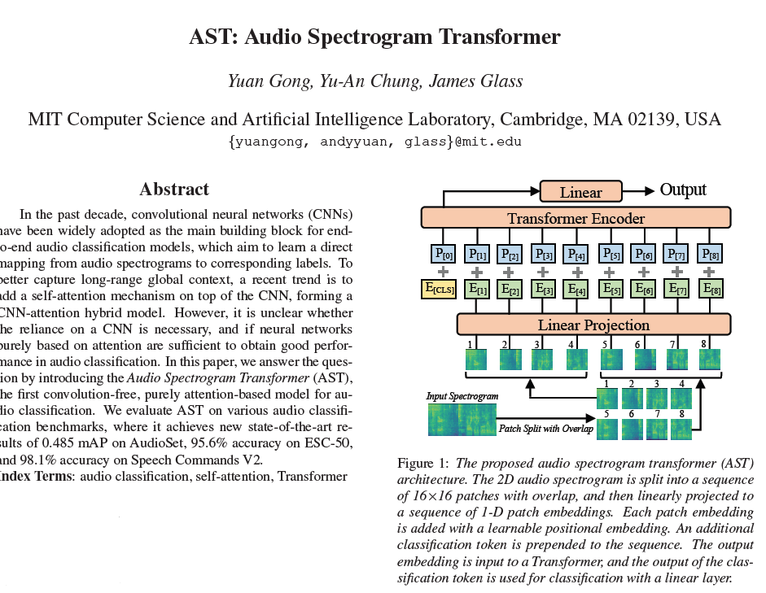
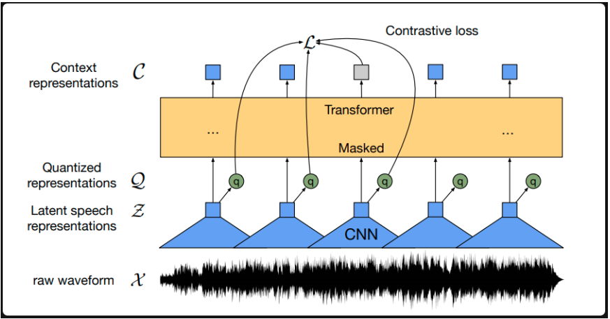
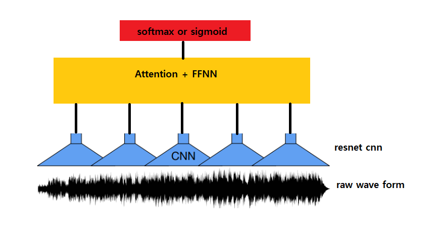
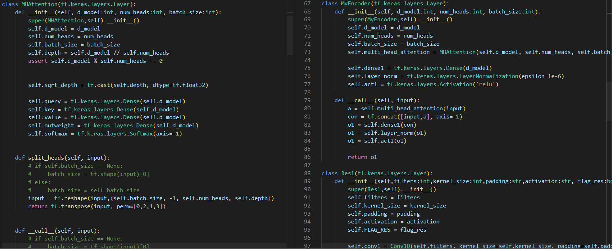

# Stroke detection on dysarthria voices

***
* Audio Classification 최신 동향1 – 음성에서 MFCC를 추출하여 이미지로 취급하여 CNN을 적용하거나 아래와 같이 CNN조차 배제하고 Transformer 만으로 음성분류를 진행함.

***
* Audio Classification 최신 동향2 – 음성에서 추출된 MFCC만으로는 음성의 특징을 제대로 반영 할 수 없으므로 추가적인 특징추출이 필요함.

***
* Audio Classification 최신 동향3 – Facebook 에서 발표한 최신모델 Wav2Vec2 model 은 음성 판별이 아닌 음성인식을 위한 모델이지만 음성을 raw input으로 하여 우수한 성능을 보임.

***
* Audio Classification 모델 개발1 – Wav2Vec2 모델에서 적용한 raw waveform을 인풋으로 하여 Custom Resnet으로 특징을 추출 한 이후 Transformer모델에서 필요 없는 부분이 제거하여 Classification 모델로 개발함.

***
* Audio Classification 모델 개발2 – 1 차 모델개발 (model2.py)
